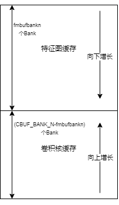
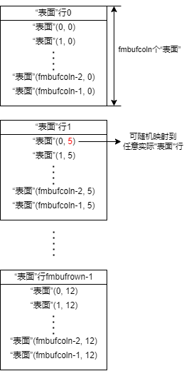
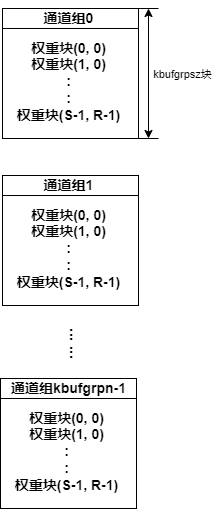
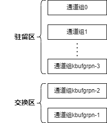
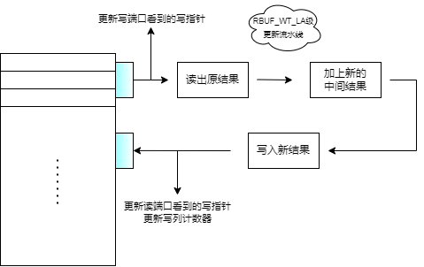
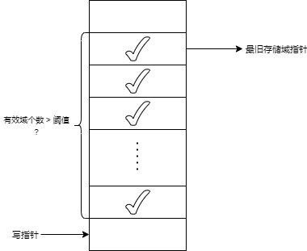

## 1 特征图和卷积核缓存

特征图和卷积核缓存是通用卷积计算单元的私有缓存，由*CBUF_BANK_N*个深度为512、位宽为$ATOMIC \times 2$字节的单端口SRAM组成。必须满足$CBUF\_BANK\_N \geq 4$。


分配给特征图缓存和卷积核缓存的Bank数量是可运行时配置的。设分配给特征图缓存的Bank为*fmbufbankn*个，则分配给卷积核缓存的Bank为$(CBUF\_BANK\_N - fmbufbankn)$个。为了支持INT8运算数据格式，特征图缓存中每个“表面”的物理地址应是逻辑地址的**右移1位**。另外，与特征图缓存向下增长的存储方式不同，卷积核缓存是向上增长的，因此卷积核缓存中每个权重“表面”的物理地址应是逻辑地址的**右移1位再按位取反**。



特征图和卷积核缓存带有4个ICB从接口，分别用于特征图读/写和卷积核读/写。当不同的ICB主机访问相同Bank时，访问请求将被仲裁并选择其中一个ICB主机接受访问。当不同的ICB主机访问互不相同的Bank时，访问请求可以被同时处理。特征图读/写ICB主机、卷积核读/写ICB主机给出的都是**逻辑地址**，该**逻辑地址**会被转换到特征图和卷积核缓存下的**物理地址**，保证特征图读/写ICB主机只访问特征图缓存区域，而卷积核读/写ICB主机只访问卷积核缓存区域。如果ICB主机的访问地址超出了特征图缓存或卷积核缓存区域的物理空间大小，应给出总线错误响应，并且不会执行实际的存储器访问操作。

特征图和卷积核缓存给出*CBUF_BANK_N*个存储器主接口，而不是在内部直接例化*CBUF_BANK_N*个SRAM。这是因为，特征图和卷积核缓存的容量较大，该缓存所需的SRAM会在外部例化，从而实现在通用卷积计算单元不工作时这些SRAM可以被其他模块复用。

#### 1.1 特征图缓存

特征图缓存是以“表面”行作为存储单位的。“表面”行是指处于同一通道组、同一行的“表面”簇。特征图缓存最多可以存储*fmbufrown*个“表面”行。每个“表面”行最多包含*fmbufcoln*个“表面”。为了便于计算特征图缓存的“表面”行基址，*fmbufcoln*只能是32、64、128、256、512、1024、2048或4096。必须满足$fmbufrown \leq MAX\_FMBUF\_ROWN$，这是因为硬件仅考虑了*MAX_FMBUF_ROWN*个**逻辑**“表面”行到**实际**“表面”行的随机映射。必须满足$fmbufrown \times fmbufcoln \leq fmbufbankn \times 512$，否则特征图缓存的大小超过其可用的物理存储空间。

如果一个“表面”行实际上包含少于*fmbufcoln*个“表面”，则剩余的“表面”**无需填0**，存入特征图数据时建议跳过这段存储空间。如果某个“表面”行中的每个“表面”包含少于*ATOMIC_C*个特征点（可能在缓存最后1个通道组时发生），则这些“表面”剩余的特征点**必须填0**。

每个“表面”行的大小（以字节计）为
$$
\begin{cases}   fmbufcoln \times ATOMIC\_C， & 若calfmt为INT8 \\ fmbufcoln \times (ATOMIC\_C \times 2)， & 若calfmt为INT16或FP16 \end{cases}
$$
特征图缓存的存储形式如下图所示。



为特征图缓存中的每个“表面”行存储域设置一个**实际映射“表面”行位置寄存器**和**有效标志**，用来表示这个区域所存储“表面”行的通道组号和行号，并指示这个存储域是否有效。硬件实现时至少需要设置*MAX_FMBUF_ROWN*个**实际映射“表面”行位置寄存器**和**有效标志**。


> 为了减小芯片面积，可以考虑<u>将特征图缓存中的“表面”行存储域分成若干个组，组内存储相同通道组号的“表面”行</u>，这样组内就可以共用位置寄存器的通道组号字段了；实际上，完全随机的通道组号映射是不必的，在卷积计算时通常是先使用某个通道组的几个“表面”行再切换到下一个通道组，而不会完全随机地访问各个通道组内的“表面”行。

当置换某个“表面”行存储域时，该区域的**有效标志**被清零。任何无效的区域都允许被写入，但不能同时对多个区域执行写操作。

如果特征图读/写ICB主机访问一个无效的“表面”行（不在特征图缓存里），那么可以给出总线错误响应，并且不会执行实际的存储器访问操作。这不是强制要求的，因为外部可以在特征图缓存中检索这个“表面”行，从而得知这个“表面”行是否已经缓存。

特征图缓存应实现**搜索某个“表面”**的功能，即给定待搜索“表面”的通道组号、行号、列号，通过*MAX_FMBUF_ROWN*个比较器将待搜索“表面”的$(通道组号, 行号)$与每个“表面”行存储域的**实际映射“表面”行位置寄存器**进行比较，输出待搜索“表面”在特征图缓存中的地址或者给出缺失标志。

> 为了减小芯片面积，采用多周期比较器而非*MAX_FMBUF_ROWN*个并行比较器也是可以接受的。

#### 1.2 卷积核缓存

卷积核缓存**最多存储1个核组**的权重数据。将卷积核缓存分成*kbufgrpn*组，每组可存储*kbufgrpsz*个卷积核权重块。应当满足$kbufgrpsz \geq R \times S$，否则卷积核缓存无法存储一个完整的通道组权重数据。为了便于计算卷积核缓存的通道组基址，*kbufgrpsz*只能是1、9、25、49、81或121。必须满足$kbufgrpn \times kbufgrpsz \times ATOMIC\_K \leq (CBUF\_BANK\_N - fmbufbankn) \times 512$，否则卷积核缓存的大小超过其可用的物理存储空间。

卷积核权重块是指在给定核组中同一卷积核点（如均位于卷积核点$(0, 0)$）的“表面”簇。一个卷积核权重块总共包含$ATOMIC\_C \times ATOMIC\_K$个卷积核权重，其中，*ATOMIC_C*在卷积核缓存的位宽方向上展开，而*ATOMIC_K*在卷积核缓存的深度方向上展开。可见，一个卷积核权重块最多有*ATOMIC_K*个卷积核**逻辑**“表面”。如果一个卷积核权重块实际上包含少于*ATOMIC_K*个卷积核“表面”（可能在缓存最后1个核组、计算**组卷积**或者计算**膨胀卷积**时发生），则剩余的卷积核**逻辑**“表面”**无需填0**，存入权重数据时建议跳过这段存储空间。如果每个卷积核“表面”包含少于*ATOMIC_C*个卷积核权重（可能在缓存最后1个通道组或者计算**组卷积**时发生），则这些“表面”剩余的卷积核权重**必须填0**。

每个通道组的大小（以字节计）为
$$
\begin{cases}   kbufgrpsz \times ATOMIC\_K \times ATOMIC\_C， & 若calfmt为INT8 \\ kbufgrpsz \times ATOMIC\_K \times (ATOMIC\_C \times 2)， & 若calfmt为INT16或FP16 \end{cases}
$$

<span id="卷积核缓存的存储形式">卷积核缓存的存储形式如下图所示。</span>



将卷积核缓存分成**交换区**和**驻留区**两部分。若$kbufgrpn \geq cgrpn$，则卷积核缓存只有**驻留区**，卷积核缓存可以存储整个核组的权重数据。否则，我们将$(kbufgrpn - 2)$组作为**驻留区**，剩下2组作为**交换区**。**驻留区**的通道组号加上一个起始通道组号是和它实际存储的卷积核权重的通道组号相对应的，而**交换区**则不是。必须满足$kbufgrpn \geq 3$。对于**组卷积**来说，每个核组对应的有效通道组数*cgrpn*可能是不同的，参见[起始通道组号和结束通道组号](#start_end_chn_id)。



设置一个**驻留区有效通道组计数器**，用来记录目前已经存储在**驻留区**的通道组个数，即编号为0~计数值 - 1的通道组都是有效的。该计数器的值在范围$[0, kbufgrpn - 2]$内。该计数器会在更换核组时清零。

设置一个**驻留区起始通道组号寄存器**，用来偏移**驻留区**内每个通道组实际存储的卷积核权重的通道组号。这个寄存器是为**组卷积**而配备的，若不支持**组卷积**则该寄存器恒为0。例如，设起始通道组号为3，那么当**驻留区**内的1号通道组有效时，它实际存储的卷积核权重的通道组号为
$$
起始通道组号 + 1 = 3 + 1 = 4
$$
设置一个**交换区有效通道组标志向量**，用来指示**交换区**内的2个通道组是否有效。该标志向量只有2位。该标志向量会在更换核组时清零。该标志向量的某一位会在对应通道组被置换时清零。任何有效的通道组都允许被读取，任何无效的通道组都允许被写入。不允许同时读取2个通道组，也不允许同时写入2个通道组。允许同时置换2个通道组（令对应通道组的有效标志无效）。

设置两个**交换区通道组号记录寄存器**，用来记录**交换区**内的2个通道组实际存储的卷积核权重的通道组号。


如果卷积核读/写ICB主机访问一个无效的通道组（不在卷积核缓存里），那么可以给出总线错误响应，并且不会执行实际的存储器访问操作。这不是强制要求的，因为外部可以通过特定的记录和标志寄存器来确定**驻留区**和**交换区**内通道组实际存储的卷积核权重的通道组号。

<span id="组卷积取通道组的过程">在计算**组卷积**时，允许在给定核组时从编号非0的通道组开始取，但仍会从第0个**驻留区**通道组开始存，**驻留区起始通道组号寄存器**记录了开始取的通道组号。下图中的&#10004;标记了**组卷积**下通道分组后每个卷积核的有效通道。被各种颜色覆盖的正方形展示了取通道组的过程。规定**组卷积**时$C(通道数) = K(卷积核数)$。对**组卷积**的支持是可选的。</span>


## 2 （中间）结果缓存

（中间）结果缓存存储卷积（中间）结果，内置的加法器可用于更新卷积中间结果。（中间）结果缓存由*RBUF_BANK_N*个深度为*RBUF_DEPTH*、位宽为$ATOMIC\_K \times 4$字节的简单双口SRAM组成。必须满足$RBUF\_BANK\_N \geq 2$，以实现读/写的乒乓操作。

为了保证每个SRAM都能存得下一个输出特征图“表面”行，当*calfmt*为*FP16*或*INT16*时，每一组中间结果占用缓存的一个地址，因此必须满足$RBUF\_DEPTH \geq ofmw$；当*calfmt*为*INT8*时，每两组中间结果占用缓存的一个地址，因此必须满足$RBUF\_DEPTH \geq ceil(ofmw / 2)$。


设置**中间结果缓存（读）写指针**和**（读）写列计数器**。**中间结果缓存（读）写指针**指向了待执行（读）写操作的那个SRAM。**中间结果缓存（读）写列计数器**给出了SRAM（读）写地址，每执行一次（读）写操作后，它的值会在$[0, ofmw - 1]$之间回环递增。如果在执行写操作时给出最后一个中间结果标志，那么当执行这次写操作后，**中间结果缓存写指针**的值会在$[0, RBUF\_BANK\_N - 1]$之间回环递增。**中间结果缓存读指针**在执行最后一列（即当**读列计数器**为$ofmw - 1$时）的读操作后自动在$[0, RBUF\_BANK\_N - 1]$之间回环递增。

当执行写操作时，从读出原结果、加上新的中间结果到写入新结果需要经过*RBUF_WT_LA*级的更新流水线。对写端口看到的**写指针**的更新是在更新流水线的第1级上进行的，而对读端口看到的**写指针**的更新是在更新流水线的最后1级上进行的，这样可以保证写满标志有效和读空标志无效的正确性（“虚满”和“虚空”）。对**写列计数器**的更新是在更新流水线的最后1级上进行的，这样正好对齐到SRAM的写地址。由于更新中间结果需要先读出原结果作计算后重新写回，而写地址是回环递增的，因此应当保证$ofmw \geq RBUF\_WT\_LA + 1$，否则存在读后写（Read After Write）相关性。更新流水线上应设置*ATOMIC_K*个加法器，这些加法器同时支持INT8、INT16和BF16三种运算数据格式，可在每个clk更新输出特征图上的一个“表面”的中间结果。



当执行读操作时，具有2clk的读时延。对写端口看到的**读指针**的更新是在读数据流水线的第2级上进行的，而对读端口看到的**读指针**的更新是在读数据流水线的第1级上进行的，这样可以保证写满标志无效和读空标志有效的正确性（“虚满”和“虚空”）。对**读列计数器**的更新是在读数据流水线的第1级上进行的，这样正好对齐到SRAM的读地址。


（中间）结果缓存给出$RBUF\_BANK\_N \times 2$个存储器主接口（本缓存使用简单双口RAM），而不是在内部直接例化*RBUF_BANK_N*个SRAM，这同样是为了实现在通用卷积计算单元不工作时这些SRAM可以被其他模块复用。

## 3 卷积计算流程

<span id="卷积计算过程">卷积计算过程如下面的代码段所述。注意，与《AI加速器架构设计与实现》中不同，这里是直接令$sp\_len = ofmw$，即固定一个权重块后延伸计算得到输出特征图一个“表面”行的中间结果。</span>

```c
for (k = 0; k < K; k += ATOMIC_K) { // 核组(op6)
    for (h = 0; h < ofmh; h++) { // 输出高度(op5)
        for (c = 0; c < C; c += ATOMIC_C) { // 输入通道组(op4)
            for (r = 0; r < R; r++) { // 卷积核高度(op3)
                for (s = 0; s < S; s++) { // 卷积核宽度(op2)
                    for (w = 0; w < ofmw; w++) { // 输出宽度(op1)
                        y[h][w][k:k + ATOMIC_K] += 
                            F[ry][sx][c:c + ATOMIC_C] * W[r][s][k:k + ATOMIC_K][c:c + ATOMIC_C]; // (op0)
                    }
                }
            }
        }
    }
}
```

#### 3.1 扩展特征图和扩展卷积核

卷积计算是在作了外/内填充的输入特征图（即扩展特征图）上进行的，扩展特征图上的填充点在计算时会被视为无效。扩展特征图的宽度为$输入特征图宽度 + (左部外填充数 + 右部外填充数) + (输入特征图宽度 - 1) \times 左右内填充数$。扩展特征图的高度为$输入特征图高度 + (上部外填充数 + 下部外填充数) + (输入特征图高度 - 1) \times 上下内填充数$。


下面的代码段描述了将扩展特征图中坐标$(logic\_x, logic\_y)$转换到原始特征图中坐标$(phy\_x, phy\_y)$的过程。

```c
typedef struct {
	int feature_map_width; // 输入特征图宽度
	int feature_map_height; // 输入特征图高度
	int external_padding_top; // 上部外填充数
	int external_padding_bottom; // 下部外填充数
	int external_padding_left; // 左部外填充数
	int external_padding_right; // 右部外填充数
	int inner_padding_top_bottom; // 上下内填充数
	int inner_padding_left_right; // 左右内填充数
}ConvLayerMsg;

void surface_pos_logic_to_phy(const ConvLayerMsg* layer, int logic_x, int logic_y, int* phy_x, int* phy_y, int* is_valid) {
	// 扩展后特征图的水平边界
	const int ext_j_right = 
		layer->feature_map_width + layer->external_padding_left +
		(layer->feature_map_width - 1) * layer->inner_padding_left_right - 1;
	// 扩展后特征图的垂直边界
	const int ext_i_bottom = 
		layer->feature_map_height + layer->external_padding_top + 
		(layer->feature_map_height - 1) * layer->inner_padding_top_bottom - 1;

	*phy_x = -1;
	*phy_y = -1;

	if (logic_x >= layer->external_padding_left && logic_x <= ext_j_right) {
		if ((logic_x - layer->external_padding_left) % (layer->inner_padding_left_right + 1) == 0) {
			*phy_x = (logic_x - layer->external_padding_left) / (layer->inner_padding_left_right + 1);
		}
	}

	if (logic_y >= layer->external_padding_top && logic_y <= ext_i_bottom) {
		if ((logic_y - layer->external_padding_top) % (layer->inner_padding_top_bottom + 1) == 0) {
			*phy_y = (logic_y - layer->external_padding_top) / (layer->inner_padding_top_bottom + 1);
		}
	}

	if ((*phy_x) != -1 && (*phy_y) != -1) {
		*is_valid = 1;
	}
	else {
		*is_valid = 0;
	}
}
```

为了支持**膨胀卷积**，需要对卷积核作内填充，扩展卷积核上的填充点在计算时会被视为无效。扩展卷积核的宽度为$原始卷积核宽度 + (原始卷积核宽度 - 1) \times 水平膨胀量$。扩展卷积核的高度为$原始卷积核高度 + (原始卷积核高度 - 1) \times 垂直膨胀量$。对**膨胀卷积**的支持是可选的。


下面的代码段描述了将扩展卷积核中坐标$(logic\_x, logic\_y)$转换到原始卷积核中坐标$(phy\_x, phy\_y)$的过程。

```c
void kernal_pos_logic_to_phy(int kernal_width, int kernal_height, int kernal_dilate_horizontal, int kernal_dilate_vertical, int logic_x, int logic_y, int* phy_x, int* phy_y, int* is_valid) {
	*phy_x = -1;
	*phy_y = -1;

	if (logic_x % (kernal_dilate_horizontal + 1) == 0) {
		*phy_x = logic_x / (kernal_dilate_horizontal + 1);
	}

	if (logic_y % (kernal_dilate_vertical + 1) == 0) {
		*phy_y = logic_y / (kernal_dilate_vertical + 1);
	}

	if ((*phy_x) != -1 && (*phy_y) != -1) {
		*is_valid = 1;
	}
	else {
		*is_valid = 0;
	}
}
```

#### <span id="start_end_chn_id">3.2 起始通道组号和结束通道组号</span>

对于**组卷积**来说，每当切换核组时，都要确定需要计算的起始通道组号和结束通道组号，参见[组卷积取通道组的过程](#组卷积取通道组的过程)。下面的代码段描述了如何对每个核组计算它的起始通道组号和结束通道组号。规定**组卷积**时$C(通道数) = K(卷积核数)$，通道数*C*能够被分组数*group_n*整除。对**组卷积**的支持是可选的。

```c
void get_valid_chn_grp(int chn_kernal_n, int atomic_c, int atomic_k, int group_n) {
	const int group_sz = chn_kernal_n / group_n; // 分组大小
	const int kernal_grp_n = chn_kernal_n / atomic_k + ((chn_kernal_n % atomic_k) ? 1 : 0); // 核组数

	int now_start_kid = 0; // 当前的起始卷积核号
	int now_end_kid = atomic_k - 1; // 当前的结束卷积核号

	for (int i = 0; i < kernal_grp_n; i++) {
		if (i == kernal_grp_n - 1) {
			now_end_kid = chn_kernal_n - 1;
		}

		int start_group_id = now_start_kid / group_sz; // 起始分组号
		int end_group_id = now_end_kid / group_sz; // 结束分组号

		int start_chn_id = start_group_id * group_sz; // 起始通道号
		int end_chn_id = (end_group_id + 1) * group_sz - 1; // 结束通道号

		int start_chn_group_id = start_chn_id / atomic_c; // 起始通道组号
		int end_chn_group_id = end_chn_id / atomic_c; // 结束通道组号

		printf("起始通道组号(含) = %d, 结束通道组号(含) = %d\n", start_chn_group_id, end_chn_group_id);

		now_start_kid += atomic_k;
		now_end_kid += atomic_k;
	}
}
```

> 考虑到核组数*kernal_grp_n*不会太大，可以将每个核组对应的起始通道组号和结束通道组号提前算好，并由CPU存储到SRAM，这样可以降低硬件设计的复杂度。

#### 3.3 特征图缓存控制

在得到卷积层信息（如扩展卷积核宽/高、扩展特征图宽/高、通道组数、卷积步长等）后，就可以开始产生特征图缓存写请求，这些写请求当存在无效的“表面”行时被按序接受。特征图缓存写请求是一包一包地产生的，每包写请求对应一个op6（参见[卷积计算过程](#卷积计算过程)）阶段，在当前的op6阶段未完全前不能发送下一包写请求。需要注意的是，一旦某个“表面”行存储域由于接受写请求而进入写状态，那么这个存储域在未完成写入前仍保持在无效状态，处于这种阶段的存储域虽然处于无效状态但也不应接受其他写请求。

可以考虑采用软件辅助置换或者FIFO这两种方式来作特征图缓存管理。

##### 3.3.1 <u>特征图缓存管理方式一：软件辅助置换</u>

如果写请求被接受时存在多个无效的“表面”行存储域，必须选择**编号最小**的那个存储域执行写操作。

设置一个**op4编号寄存器**，用来表示目前op4阶段的编号。每完成一个op4阶段，该寄存器都会自动递增。如果当前计算的不是**组卷积**，那么在完成一个op6阶段后，该寄存器清零。

设置一个**置换存储域向量寄存器**，用来表示下一次置换操作所涉及的存储域。该寄存器的每一位都与一个存储域相对应。

设置一个**置换触发寄存器**，用来表示下一次置换操作所对应的op4编号。每当完成一个op4阶段时，会进行“表面”行的置换检查，如果**op4编号寄存器**跟**置换触发寄存器**一样，则对**置换存储域向量寄存器**所指示的那些存储域执行置换操作。

设置两个**置换辅助表**，分别是**置换触发寄存器增量表**和**置换存储域向量表**，另有一个**置换辅助表指针**给出了读地址。在计算某个核组的第一个“表面”之前，或者执行一次置换操作之后，从**置换触发寄存器增量表**取出一个增量并让**置换触发寄存器**加上这个增量，从**置换存储域向量表**取出一个置换存储域向量并保存在**置换存储域向量寄存器**里。在**置换触发寄存器增量表**中，有效的增量是在范围$[0, 254]$内。如果取到的增量是255，那么**置换触发寄存器**、**置换辅助表指针**和**置换存储域向量寄存器**都清零，这样可以在新的op6阶段里重新读**置换辅助表**（如果当前计算的不是**组卷积**的话）。


> **置换辅助表**所需的容量可能较大，但是通用卷积计算单元对**置换辅助表**的带宽要求并不高，而且它们中的内容都是可以离线生成的，因此可以考虑使用片外Flash来存储**置换辅助表**。

##### 3.3.2 <u>特征图缓存管理方式二：FIFO</u>

设置一个**特征图缓存写指针**，每当写请求被接受时，选择**特征图缓存写指针**所指向的那个存储域执行写操作。写操作完成后，**特征图缓存写指针**在$[0, fmbufrown - 1]$之间回环递增。完成一个op6阶段后，该寄存器清零。

设置一个**特征图缓存最旧存储域指针**，它指向了特征图缓存中最旧的那个存储域（如果该存储域是有效的话）。当执行一次置换操作后，**特征图缓存最旧存储域指针**在$[0, fmbufrown - 1]$之间回环递增。完成一个op6阶段后，该寄存器清零。

每当完成一个op3阶段时，检查特征图缓存中有效存储域的个数，如果有效存储域的个数大于给定的阈值，则对**特征图缓存最旧存储域指针**所指示的那些存储域执行置换操作。



#### 3.4 卷积核缓存控制

如果想在卷积核缓存中查找编号为*kbufgrpid*的通道组内的权重块$(x, y)$，那么需要先在缓存中搜索出它的通道组基址，再加上它的权重块偏移地址$kbufwtblkofs = x \times ATOMIC\_K + y \times S \times ATOMIC\_K$，才能定位到这个权重块，参见[卷积核缓存的存储形式](#卷积核缓存的存储形式)。在卷积计算时，权重块是按顺序取出的（从点$(0, 0)$到点$(S-1, R-1)$），因此不必使用乘法器来计算权重块偏移地址。

在卷积计算时用完某个通道组的权重后，如果这个通道组是位于卷积核缓存的**交换区**里的，那么这个通道组可以被置换。每当使用一个新的核组时，卷积核缓存应被复位，然后取$min(cgrpn, 驻留区数量)$个通道组的权重数据并固定在**驻留区**，接着等待外部发起**交换区**写请求（如果**交换区**存在的话）。

**交换区**写请求可以在换入新的核组时就立即开始生成，要载入的卷积核权重的通道组号在$[驻留区起始通道组号 + kbufgrpn - 2, 驻留区起始通道组号 + cgrpn - 1]$之间循环*ofmh*次。显然，**交换区**写请求是在载入完**驻留区**之后才开始处理的，并且当存在无效的通道组时被按序接受。需要注意的是，一旦某个通道组由于接受写请求而进入写状态，那么这个通道组在未完成写入前仍保持在无效状态，处于这种阶段的通道组虽然处于无效状态但也不应接受其他写请求。

## 4 运算数据通路

通用卷积计算单元采用二维乘加阵列作为运算数据通路，参见《AI加速器架构设计与实现》的第47页。输入特征图的一个“表面”扇出给*ATOMIC_K*个乘加单元。每个乘加单元都需要使用一个卷积核权重“表面”。在每个乘加单元中，都有一个*ATOMIC_C*输入的流水加法器来进行通道累加，得到这个特征点的中间结果。

#### 4.1 卷积乘加阵列

卷积乘加单元必须支持*INT16*、*FP16*这两种运算数据格式，对*INT8*的支持是可选的。

*FP16*是具有1个符号位（S）、5个指数位（E）、10个尾数位（M）的半精度浮点数。


在浮点运算模式下，卷积乘加单元需要计算*ATOMIC_C*个浮点乘法，再作*ATOMIC_C*输入的浮点加法，因此考虑将浮点乘法和浮点加法结合起来。卷积乘加单元需要同时支持整型和浮点运算模式，因此考虑实现整型乘加和浮点乘加的资源共享。

每个*FP16*都可以表示为

$value = (-1)^S \times 2^{E[4:0] - 15} \times (\{1, M[9:0]\} \times 2^{-10})$

$\quad\quad\,\,\,\,=(-1)^S \times 2^{E[4:0] - 25} \times \{1, M[9:0]\}$

$\quad\quad\,\,\,\,=(-1)^S \times 2^{\{E[4:2],2'b00\} - 25} \times (\{1, M[9:0]\} \times 2^{E[1:0]})$

$\quad\quad\,\,\,\,=(-1)^S \times 2^{\{E[4:2],2'b00\} - 25} \times (\{1, M[9:0]\} << E[1:0])$（非规则浮点数除外）。

令$MTS = \begin{cases}   \{0, M[9:0]\} << 1， & 若E[4:0]为5'b00000 \\ \{1, M[9:0]\} << E[1:0]， & 若E[4:0]不为5'b00000 \end{cases}$。令$exp' = E[4:2]$。

*ATOMIC_C*个浮点乘加可表示为

$MAC\_OUT = \sum_{i=0}^{ATOMIC\_C-1}(value_{fi} \times value_{wi})$

$\quad\quad\quad\quad\quad\,\,\,\,=\sum_{i=0}^{ATOMIC\_C-1}[(-1)^{S_{fi} + S_{wi}} \times MTS_{fi} \times MTS_{wi} \times 2^{4(exp'_{fi} + exp'_{wi}) - 50}]$。

其中，$_{fi}$是特征点编号，$_{wi}$是权重编号。

$4(exp'_{fi} + exp'_{wi})$可变换为$FUNC \times 4 - [FUNC - (exp'_{fi} + exp'_{wi})] \times 4$。现在令$SET_i = [FUNC - (exp'_{fi} + exp'_{wi})] \times 4$，$FUNC' = FUNC \times 4$，$MTS_{oi} = MTS_{fi} \times MTS_{wi}$。那么，$4(exp'_{fi} + exp'_{wi})=FUNC'-SET_i$。

此时，$MAC\_OUT = \sum_{i=0}^{ATOMIC\_C-1}[(-1)^{S_{fi} + S_{wi}} \times MTS_{oi} \times 2^{FUNC' -SET_i - 50}]$

$\quad\quad\quad\quad\quad\quad\quad\quad\,\,=2^{FUNC'-50} \times \sum_{i=0}^{ATOMIC\_C-1}[(-1)^{S_{fi} + S_{wi}} \times (MTS_{oi} >> SET_i)]$。

令$FUNC = \max_{i=0}^{ATOMIC\_C-1}(exp'_{fi} + exp'_{wi})$，即对齐到最大阶码，则$SET_i \geq 0$。

这样，计算结果的尾数位部分的位宽为$2 \times (MTS的位宽 + 符号位) + 通道累加导致的扩展位宽 = [(10 + 1 + 3) + 1] \times 2 + log_2(ATOMIC\_C) = 30 + log_2(ATOMIC\_C)$，指数位部分的位宽为$FUNC'的位宽 = FUNC的位宽 + 2 = (exp'的位宽 + 1) + 2 = (3 + 1) + 2 = 6$。

<span id="MAC_OUT">最终，$MAC\_OUT = 2^{\{E'[3:0], 2'b00\} - 50} \times F'[29 + log_2(ATOMIC\_C):0]$。其中$E'$是计算结果的指数位的高4位，$F'$是计算结果的尾数位。</span>

可见，在计算$MTS_{oi} = MTS_{fi} \times MTS_{wi}$时可以复用$16位 \times 16位$的整型乘法器，而进行通道累加时也可以复用32位的整型加法器。为了支持*FP16*运算格式，只需要额外增加一些移位电路。

#### 4.2 卷积中间结果加法器

当*calfmt*为*INT16*或*INT8*时，中间结果的存储格式是32位或16位整型，中间结果累加使用32位或16位加法器。

当*calfmt*为*FP16*时，中间结果的存储格式是FP32，中间结果累加需要计算FP32与*MAC_OUT*（参见4.1小节）的和。在计算浮点加法时，首先将FP32与*MAC_OUT*（参见4.1小节）对阶（小阶向大阶看齐），然后作尾数求和，最后再作格式化。

## 5 线性乘加和激活

请继续编写

#### 5.1 线性乘加

请继续编写

#### 5.2 激活

请继续编写

